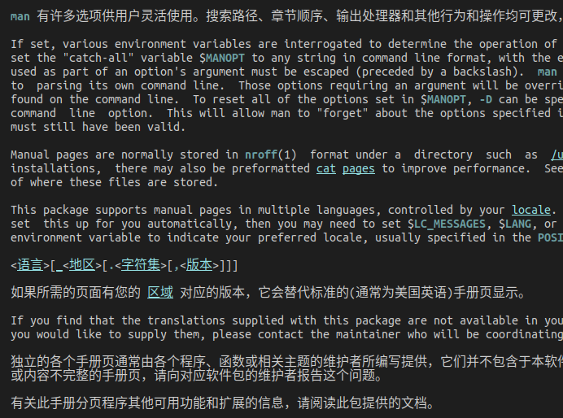
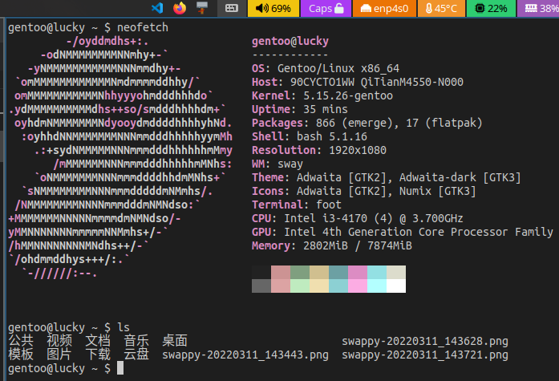
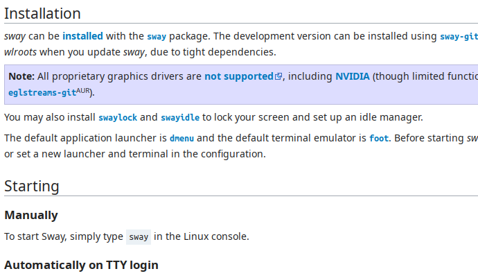
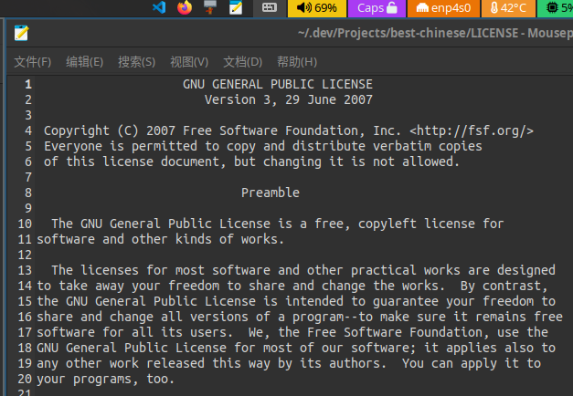
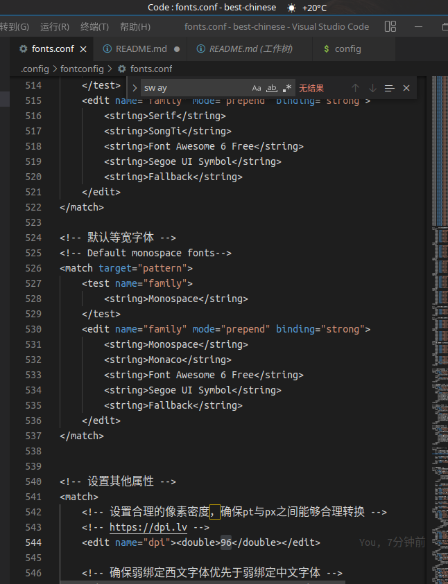

# Linux 最佳中文字体美化

### 介绍
Linux最佳中文字体美化方案，含用户目录配置和字体，拷贝到自己主目录后重启电脑或者刷新字体缓存即可！适合所有Linux操作系统。

### 达不到图片效果的尝试
1. 执行 fonts.sh 脚本，选择删除系统中可能影响字体效果的配置；
2. 注意：删除系统配置实际上是备份在了 /etc/fonts/conf.d.bak

### 如果仍然达不到图片效果的尝试
1. 执行 purge-fonts.sh 脚本，删除系统中多余的字体（推荐：字体越少效果越好！）。
2. 注意：purge-fonts.sh 脚本的存在，是作者认为此时系统中提供的字体已经没有价值了，没有必要占据硬盘空间，降低系统性能。

### 效果图

#### 中英混排

#### 终端

#### 中文网页

#### 英文

#### 代码

### 致谢
本项目大量借鉴金步国先生的作品: http://www.jinbuguo.com/gui/linux_fontconfig.html
在此感谢金步国先生为开源做出的贡献。