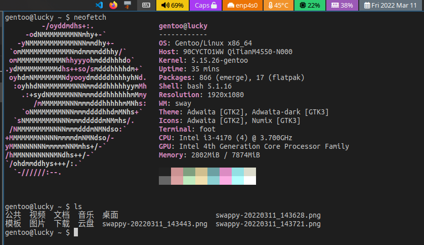

# best-chinese
Linux最佳中文字体美化方案，拷贝即用！适合所有Linux操作系统。

<b>技术支持QQ群：19346666、111601117</b>

<b>技术支持钉钉群：35948877</b>

## 效果图

### 中英混排

### 终端

### 中文网页

### 英文

### 代码

## 致谢
本项目大量借鉴金步国先生的作品: http://www.jinbuguo.com/gui/linux_fontconfig.html
在此感谢金步国先生为开源做出的贡献。